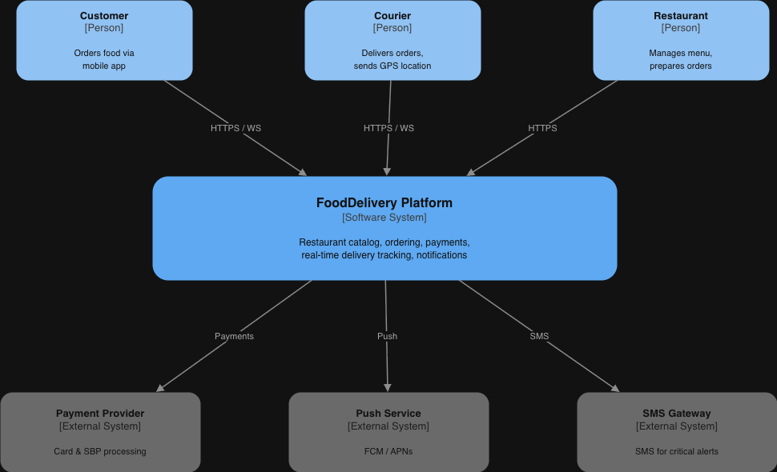
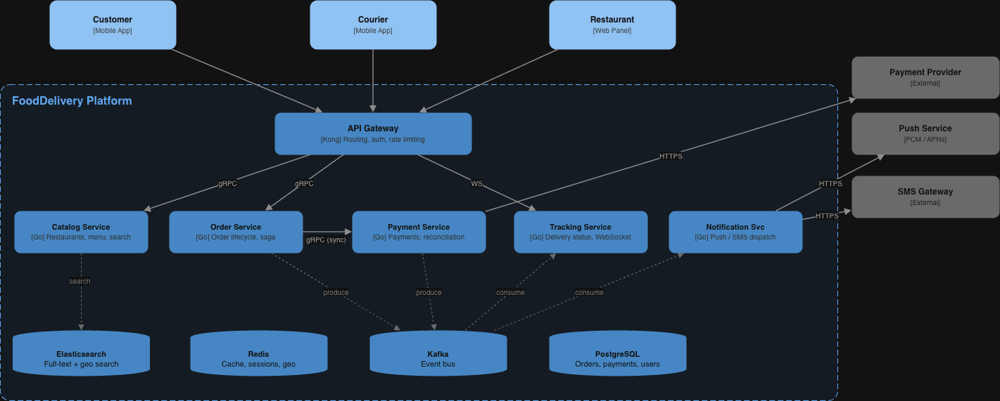
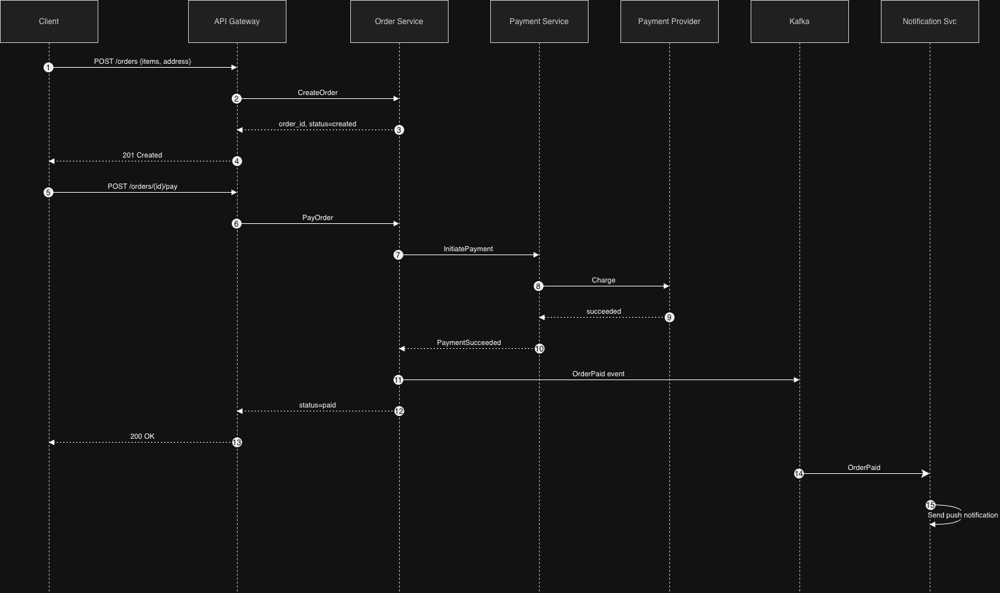
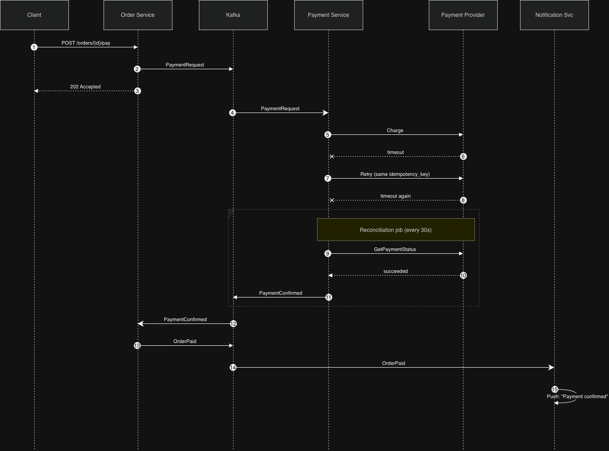
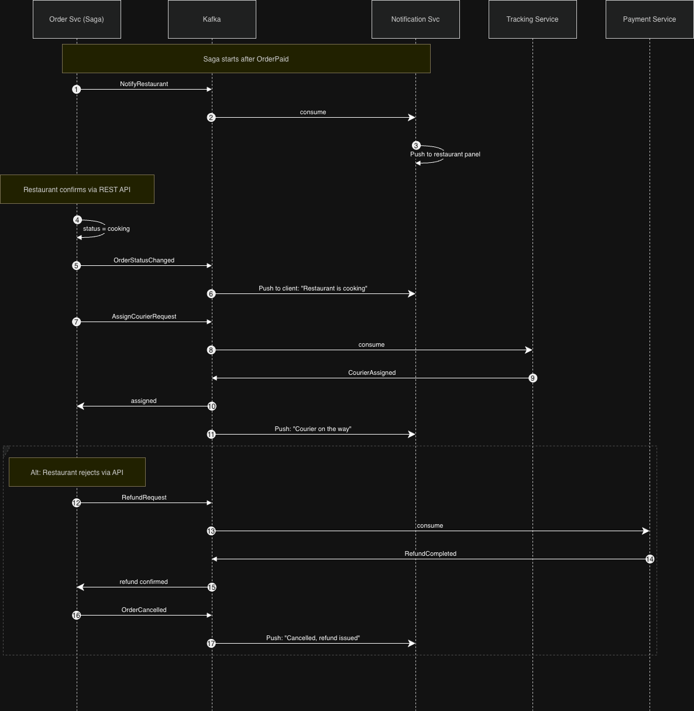

# Архитектура

## 1. Архитектурный стиль и обоснование

### Выбор: Service-Based Architecture + Event-Driven (гибрид)

Система строится как **Service-Based Architecture (SBA)** - 6 доменных сервисов с чёткими границами - с **Event-Driven** слоем на Kafka для асинхронных потоков.

**Почему не монолит.** Разные части системы живут в разных мирах нагрузки. Каталог - это 2 800 RPS чистого чтения, и ему нужен Elasticsearch + агрессивный кэш. Оплата - 550 RPS записи, и ей нужна ACID-гарантия и 99.99 % uptime. Трекинг - WebSocket на 25–30 тыс. соединений. Масштабировать это как единое целое расточительно: чтобы добавить мощностей каталогу, пришлось бы поднимать лишние реплики платёжной логики. Кроме того, монолит не даёт изоляции отказов - баг в уведомлениях может положить всю систему.

**Почему не микросервисы.** Команда небольшая, бюджет ограничен, time-to-market жёсткий. Полноценный MSA с десятками сервисов, service mesh, contract testing и независимыми CI/CD-пайплайнами - это операционная нагрузка, которая не окупается при 5 разработчиках. SBA даёт нам 6 сервисов вместо 20+, и каждый разработчик может владеть одним-двумя целиком.

**Почему EDA в дополнение.** Жизненный цикл заказа - это цепочка шагов с участием нескольких сервисов. Прямые синхронные вызовы между всеми создали бы каскадные отказы. Kafka развязывает сервисы: Order Service публикует `OrderPaid`, а Notification Service, Tracking Service и Catalog Service потребляют это событие независимо. Если Notification упал - события копятся в Kafka и обработаются после восстановления, а оплата и трекинг продолжают работать.

> Подробное обоснование: [ADR-001: Service-Based Architecture](adr/001-service-based-architecture.md)

---

## 2. Компоненты системы (C4 L1 + L2)

### 2.1. System Context (C4 Level 1)

Диаграмма: [`docs/diagrams/c4-l1-context.drawio`](diagrams/c4-l1-context.drawio)



**Акторы:**

| Актор | Описание |
|-------|----------|
| Клиент | Мобильное приложение (iOS/Android). Ищет рестораны, собирает корзину, оплачивает, отслеживает доставку через WebSocket |
| Курьер | Мобильное приложение. Получает назначения, отправляет геопозицию каждые 5 с, обновляет статус доставки |
| Ресторан | Веб-панель. Управляет меню, получает входящие заказы, отмечает готовность |

**Внешние системы:**

| Система | Роль |
|---------|------|
| Платёжный провайдер | Процессинг карт и СБП. SLA провайдера: p99 ~700 ms, доступность ~99.95 % |
| Push-сервис (FCM/APNs) | Доставка push-уведомлений на устройства клиентов и курьеров |
| SMS-шлюз | Резервный канал для критичных уведомлений (подтверждение оплаты, отмена) |

### 2.2. Container Diagram (C4 Level 2)

Диаграмма: [`docs/diagrams/c4-l2-container.drawio`](diagrams/c4-l2-container.drawio)



На диаграмме: сплошные стрелки - синхронные вызовы (gRPC/HTTPS), пунктирные - асинхронные (Kafka produce/consume). Data stores не обвязаны стрелками к каждому сервису, чтобы не перегружать; детали связей - в таблице ниже

### 2.3. Описание компонентов

#### Сервисы (stateless)

| # | Компонент | Технология | Назначение | Коммуникация |
|---|-----------|-----------|------------|-------------|
| 1 | **API Gateway** | Kong | Единая точка входа. Маршрутизация запросов к внутренним сервисам, JWT-аутентификация, rate limiting (token bucket, 100 req/s на пользователя), TLS termination. Проксирует WebSocket-соединения для трекинга | sync - HTTPS/WSS от клиентов, gRPC к сервисам |
| 2 | **Catalog Service** | Go | Управление каталогом ресторанов и меню. CRUD для ресторанов (от ресторанной панели). Поиск: полнотекстовый + по кухне/рейтингу/расстоянию делегируется в Elasticsearch. Меню кэшируется в Redis (TTL 5 мин). | sync - gRPC от Gateway, SQL к PG, REST к ES, GET/SET к Redis |
| 3 | **Order Service** | Go | Ядро бизнес-логики. Создание заказа, управление корзиной, state machine статусов (created → paid → cooking → courier_assigned → picked_up → delivered / cancelled). Saga-оркестратор: координирует оплату, подтверждение ресторана, назначение курьера | sync - gRPC от Gateway и к Payment Service; async - produce/consume через Kafka |
| 4 | **Payment Service** | Go | Инициация платежей через внешний провайдер, обработка webhook-callback-ов, сверка (reconciliation). Идемпотентность через `idempotency_key`. Выделен в отдельный сервис для изоляции PCI DSS scope | sync - gRPC от Order Service, HTTPS к провайдеру; async - produce в Kafka |
| 5 | **Tracking Service** | Go | Приём координат от курьеров (через API), хранение в Redis (GEOADD), вычисление ETA. WebSocket-сервер для push обновлений статуса клиенту. Потребляет события из Kafka (OrderPaid, CourierAssigned) для обновления состояния | sync - WebSocket к клиентам, GEO к Redis; async - consume/produce через Kafka |
| 6 | **Notification Service** | Go | Потребляет события из Kafka и рассылает уведомления: push через FCM/APNs (основной канал), SMS через шлюз (для критичных: оплата, отмена). Retry с экспоненциальным backoff, dead letter queue для неудавшихся | async - consume из Kafka, HTTPS к внешним push/SMS |

#### Хранилища (stateful)

| # | Компонент | Назначение | Обоснование выбора |
|---|-----------|------------|-------------------|
| 7 | **PostgreSQL** | Основное хранилище: заказы, платежи, рестораны, пользователи, saga_state | ACID-гарантии для финансовых данных, синхронная репликация для durability |
| 8 | **Redis** | Кэш каталога/меню, сессии, координаты курьеров (GEO), rate limit counters | Sub-ms latency, TTL для горячих данных, встроенные geo-команды (GEOADD/GEORADIUS) |
| 9 | **Kafka** | Шина событий между сервисами: OrderCreated, OrderPaid, StatusChanged, уведомления | Durable append-only log, гарантия доставки, replay при сбоях, fan-out на несколько consumer groups |
| 10 | **Elasticsearch** | Полнотекстовый поиск ресторанов, фильтрация по кухне/рейтингу, геопоиск по расстоянию | Inverted index + geo_point, горизонтальное масштабирование для 2 800 RPS поисковых запросов |

**Итого: 10 компонентов** (6 сервисов + 4 хранилища)

---

## 3. Sequence Diagrams

### 3.1. Happy Path - оформление и оплата заказа

Диаграмма: [`docs/diagrams/seq-happy-path.drawio`](diagrams/seq-happy-path.drawio)



**Описание.** Клиент создаёт заказ (шаги 1–6), затем оплачивает его (шаги 7–20). Order Service синхронно вызывает Payment Service, который обращается к внешнему провайдеру. После успешной оплаты заказ переводится в статус `paid`, событие публикуется в Kafka, и Notification Service асинхронно отправляет push. Весь синхронный путь укладывается в latency budget ~980 ms (p99), что ниже SLO в 2 000 ms

### 3.2. Ошибка - таймаут платёжного провайдера

Диаграмма: [`docs/diagrams/seq-payment-failure.drawio`](diagrams/seq-payment-failure.drawio)



**Описание.** Платёжный провайдер - bottleneck (p99 ~700 ms). При таймауте Payment Service делает одну повторную попытку с тем же `idempotency_key` (идемпотентность гарантирует, что повторный вызов не спишет деньги дважды). Если retry тоже провалился - платёж переводится в `requires_confirmation`, клиенту возвращается «оплата обрабатывается» (не ошибка). Фоновый reconciliation job каждые 30 секунд опрашивает провайдера о статусе незавершённых платежей. Когда статус подтверждён - событие `PaymentConfirmed` идёт через Kafka, заказ переводится в `paid`, клиент получает push. Такой подход гарантирует, что деньги не теряются и клиент не остаётся в неведении

### 3.3. Асинхронный сценарий - saga жизненного цикла заказа

Диаграмма: [`docs/diagrams/seq-async-saga.drawio`](diagrams/seq-async-saga.drawio)



**Описание.** После оплаты Order Service (saga-оркестратор) запускает цепочку асинхронных шагов через Kafka. Каждый шаг саги фиксируется в таблице `saga_state` - при рестарте сервиса незавершённые саги продолжатся с последнего шага. Если ресторан отклоняет заказ - запускается компенсация: refund через Payment Service и отмена заказа. Клиент получает push на каждом этапе. Весь процесс асинхронный - клиент не ждёт в UI, а видит обновления через WebSocket/push

> Подробнее: [ADR-003: Saga-оркестрация](adr/003-saga-orchestration-for-orders.md)

---

## 4. API Design

Подход к версионированию: **URL path versioning** (`/api/v1/`). При ломающих изменениях создаётся `/api/v2/`, старая версия живёт 6 месяцев. Формат: REST + JSON. Аутентификация: Bearer JWT в заголовке `Authorization`

### 4.1. Поиск ресторанов

```
GET /api/v1/restaurants?query=суши&lat=55.75&lon=37.62&radius=5000&cuisine=japanese&sort=rating&page=1&limit=20
```

**Описание:** Полнотекстовый и геопоиск ресторанов с фильтрацией

**Query-параметры:**

| Параметр | Тип | Обязательный | Описание |
|----------|-----|:---:|----------|
| query | string | нет | Текстовый запрос (название, блюдо) |
| lat, lon | float | да | Координаты пользователя |
| radius | int | нет | Радиус поиска в метрах (по умолчанию 3000) |
| cuisine | string | нет | Фильтр по типу кухни |
| sort | string | нет | Сортировка: `rating`, `distance`, `price` (по умолчанию `distance`) |
| page, limit | int | нет | Пагинация (по умолчанию page=1, limit=20) |

**Response 200:**

```json
{
  "restaurants": [
    {
      "id": "f47ac10b-58cc-4372-a567-0e02b2c3d479",
      "name": "Суши Мастер",
      "cuisine": "japanese",
      "rating": 4.7,
      "avg_price": 800,
      "distance_m": 1200,
      "delivery_time_min": 35,
      "image_url": "https://example.domain/imge.jpg",
      "is_open": true
    }
  ],
  "total": 42,
  "page": 1,
  "limit": 20
}
```

**Ошибки:**

| Код | Описание |
|-----|----------|
| 400 | Невалидные координаты или параметры |
| 429 | Rate limit exceeded (100 req/s на пользователя) |
| 503 | Поиск временно не работает |

### 4.2. Получение меню ресторана

```
GET /api/v1/restaurants/{restaurant_id}/menu
```

**Описание:** Полное меню ресторана с категориями. Кэшируется в Redis (TTL 5 мин)

**Response 200:**

```json
{
  "restaurant_id": "f47ac10b-58cc-4372-a567-0e02b2c3d479",
  "categories": [
    {
      "name": "Роллы",
      "items": [
        {
          "id": "a1b2c3d4-e5f6-7890-abcd-ef1234567890",
          "name": "Филадельфия",
          "description": "Лосось, сливочный сыр, огурец, рис",
          "price": 590,
          "image_url": "https://https://example.domain/imge_susi.jpg",
          "is_available": true
        }
      ]
    }
  ],
  "updated_at": "2026-04-18T10:00:00Z"
}
```

**Ошибки:**

| Код | Описание |
|-----|----------|
| 404 | Ресторан не найден |
| 503 | Сервис временно недоступен |

### 4.3. Создание заказа

```
POST /api/v1/orders
```

**Описание:** Создание нового заказа из корзины

**Request:**

```json
{
  "restaurant_id": "f47ac10b-58cc-4372-a567-0e02b2c3d479",
  "items": [
    {"menu_item_id": "a1b2c3d4-e5f6-7890-abcd-ef1234567890", "quantity": 2},
    {"menu_item_id": "b2c3d4e5-f6a7-8901-bcde-f12345678901", "quantity": 1}
  ],
  "delivery_address": {
    "lat": 55.7558,
    "lon": 37.6173,
    "address_text": "ул. Тверская, д. 1, кв. 10"
  },
  "comment": "Не звонить в дверь"
}
```

**Response 201:**

```json
{
  "order_id": "c3d4e5f6-a7b8-9012-cdef-123456789012",
  "status": "created",
  "items": [
    {"menu_item_id": "a1b2c3d4-e5f6-7890-abcd-ef1234567890", "name": "Филадельфия", "quantity": 2, "unit_price": 590, "total_price": 1180},
    {"menu_item_id": "b2c3d4e5-f6a7-8901-bcde-f12345678901", "name": "Мисо-суп", "quantity": 1, "unit_price": 250, "total_price": 250}
  ],
  "total_amount": 1430,
  "estimated_delivery": "2026-04-18T13:15:00Z",
  "created_at": "2026-04-18T12:40:00Z"
}
```

**Ошибки:**

| Код | Описание |
|-----|----------|
| 400 | Невалидные данные (пустая корзина, отрицательное количество) |
| 404 | Ресторан или позиция меню не найдены |
| 409 | Позиция меню недоступна (закончилась) |
| 422 | Ресторан закрыт или не доставляет по указанному адресу |
| 429 | Rate limit exceeded |

### 4.4. Оплата заказа

```
POST /api/v1/orders/{order_id}/pay
```

**Описание:** Инициация оплаты заказа. Идемпотентная операция - повторный вызов с тем же `Idempotency-Key` безопасен

**Headers:**

```
Idempotency-Key: 550e8400-e29b-41d4-a716-446655440000
```

**Request:**

```json
{
  "payment_method": "card",
  "card_token": "tok_visa_4242"
}
```

**Response 200 (оплата прошла):**

```json
{
  "order_id": "c3d4e5f6-a7b8-9012-cdef-123456789012",
  "payment_id": "d4e5f6a7-b8c9-0123-def0-234567890123",
  "status": "paid",
  "amount": 1430,
  "estimated_delivery": "2026-04-18T13:15:00Z"
}
```

**Response 202 (оплата обрабатывается - провайдер не ответил вовремя):**

```json
{
  "order_id": "c3d4e5f6-a7b8-9012-cdef-123456789012",
  "payment_id": "d4e5f6a7-b8c9-0123-def0-234567890123",
  "status": "payment_pending",
  "message": "Оплата обрабатывается, ожидайте"
}
```

**Ошибки:**

| Код | Описание |
|-----|----------|
| 400 | Невалидный payment_method или card_token |
| 402 | Оплата отклонена (недостаточно средств, карта заблокирована) |
| 404 | Заказ не найден |
| 409 | Заказ уже оплачен |
| 429 | Rate limit exceeded |
| 503 | Платёжный сервис временно недоступен |

### 4.5. Получение статуса доставки

```
GET /api/v1/orders/{order_id}/tracking
```

**Описание:** Текущий статус заказа и координаты курьера. Для real-time обновлений клиент подключается по WebSocket на `wss://api.fooddelivery.ru/ws/orders/{order_id}/tracking`

**Response 200:**

```json
{
  "order_id": "c3d4e5f6-a7b8-9012-cdef-123456789012",
  "status": "picked_up",
  "status_history": [
    {"status": "created", "at": "2026-04-18T12:40:00Z"},
    {"status": "paid", "at": "2026-04-18T12:40:05Z"},
    {"status": "cooking", "at": "2026-04-18T12:41:00Z"},
    {"status": "courier_assigned", "at": "2026-04-18T12:50:00Z"},
    {"status": "picked_up", "at": "2026-04-18T13:00:00Z"}
  ],
  "courier": {
    "name": "Олег",
    "phone": "+7********90",
    "location": {"lat": 55.7560, "lon": 37.6180}
  },
  "estimated_delivery": "2026-04-18T13:12:00Z",
  "updated_at": "2026-04-18T13:01:30Z"
}
```

**Ошибки:**

| Код | Описание |
|-----|----------|
| 404 | Заказ не найден |
| 403 | Нет доступа к чужому заказу |

---

## 5. Выбор БД и модель данных

### 5.1. Обоснование выбора хранилищ

| Хранилище | Паттерн доступа | Почему именно оно |
|-----------|----------------|-------------------|
| **PostgreSQL** | OLTP: частые INSERT/UPDATE заказов и платежей, JOIN-ы для аналитических запросов, строгая консистентность | ACID-транзакции - обязательны для финансовых данных (НФТ: потеря < 1 на 10M). Синхронная репликация на standby. Зрелый tooling для бэкапов (pg_basebackup, WAL-G). JSONB для расширяемых полей без миграций |
| **Redis** | Read-heavy hot data: кэш меню (5 min TTL), сессии, координаты курьеров (обновление каждые 5 с), rate limit counters | Sub-ms latency. Geo-команды (GEOADD/GEORADIUS) - координаты курьеров без отдельной GIS-БД. TTL - автоочистка устаревших данных. Redis Cluster для горизонтального масштабирования |
| **Elasticsearch** | Полнотекстовый поиск + фильтрация + геопоиск по ресторанам, 2 800 RPS в пике | Inverted index для текста, geo_point для расстояния, фасетная фильтрация (кухня, рейтинг, цена) из коробки. PG full-text search не держит 2 800 RPS с geo-фильтрацией на p50 < 150 ms |
| **Kafka** | Append-only event log: ~15 событий на заказ, fan-out на 3+ consumer groups, replay при сбоях | Durable log с retention 7 дней. Exactly-once semantics. Consumer groups - каждый сервис читает независимо. При падении consumer-а события не теряются |

> Подробное обоснование: [ADR-002: PostgreSQL + polyglot persistence](adr/002-postgresql-primary-storage.md)

### 5.2. Модель данных - основные сущности

#### Таблица `restaurants` (PostgreSQL)

Каталог ресторанов. Источник правды для ресторанных данных; синхронизируется в Elasticsearch

| Поле | Тип | Описание |
|------|-----|----------|
| **id** | UUID, PK | Идентификатор ресторана |
| name | VARCHAR(255) | Название |
| cuisine_type | VARCHAR(50) | Тип кухни (japanese, italian, ...) |
| address | TEXT | Адрес |
| lat | DECIMAL(9,6) | Широта |
| lon | DECIMAL(9,6) | Долгота |
| rating | DECIMAL(2,1) | Средний рейтинг (0.0–5.0) |
| avg_price | INT | Средний чек, рубли |
| is_active | BOOLEAN | Активен ли ресторан |
| working_hours | JSONB | Расписание работы по дням |
| created_at | TIMESTAMPTZ | Время создания |
| updated_at | TIMESTAMPTZ | Время последнего обновления |

**Индексы:**
- `idx_restaurants_geo` - GiST index по `(lat, lon)` - геопоиск ближайших ресторанов (используется при fallback, если ES недоступен)
- `idx_restaurants_cuisine` - BTREE по `(cuisine_type, rating DESC)` - фильтрация по кухне с сортировкой по рейтингу
- `idx_restaurants_active` - partial index `WHERE is_active = true` - исключаем неактивных из всех выборок

**Объём:** ~50 000 ресторанов × ~0.5 KB = ~25 MB. Рост медленный (сотни новых ресторанов в месяц). Помещается в RAM целиком

#### Таблица `orders` (PostgreSQL)

Основная транзакционная таблица. Горячие данные - заказы за последние 3 месяца; старые партиционируются по `created_at`

| Поле | Тип | Описание |
|------|-----|----------|
| **id** | UUID, PK | Идентификатор заказа |
| user_id | UUID, FK | Клиент |
| restaurant_id | UUID, FK → restaurants | Ресторан |
| courier_id | UUID, nullable | Назначенный курьер |
| status | VARCHAR(30) | created / paid / cooking / courier_assigned / picked_up / delivered / cancelled |
| delivery_address | TEXT | Адрес текстом |
| delivery_lat | DECIMAL(9,6) | Широта доставки |
| delivery_lon | DECIMAL(9,6) | Долгота доставки |
| total_amount | DECIMAL(10,2) | Сумма заказа |
| comment | TEXT | Комментарий клиента |
| estimated_delivery_at | TIMESTAMPTZ | Предполагаемое время доставки |
| created_at | TIMESTAMPTZ | Время создания |
| updated_at | TIMESTAMPTZ | Время обновления |

**Индексы:**
- `idx_orders_user` - BTREE по `(user_id, created_at DESC)` - история заказов пользователя (основной запрос из приложения)
- `idx_orders_restaurant_status` - BTREE по `(restaurant_id, status)` - список активных заказов ресторана (панель ресторана)
- `idx_orders_courier_status` - BTREE по `(courier_id, status) WHERE courier_id IS NOT NULL` - заказы курьера
- `idx_orders_status_created` - BTREE по `(status, created_at)` - мониторинг «зависших» заказов, аналитика

**Партиционирование:** RANGE по `created_at`, месячные партиции. Горячий горизонт - 3 месяца, старые партиции переносятся в архивное хранилище

**Объём:** 900 000 заказов/день × 5 KB ≈ 4.5 GB/день. За год: ~1.6 TB. За 3 года с репликацией (×2): ~10 TB

#### Таблица `payments` (PostgreSQL)

Финансовые транзакции. Максимальные требования к durability. Synchronous replication обязательна

| Поле | Тип | Описание |
|------|-----|----------|
| **id** | UUID, PK | Идентификатор платежа |
| order_id | UUID, FK → orders | Связанный заказ |
| amount | DECIMAL(10,2) | Сумма |
| currency | CHAR(3) | Валюта (RUB) |
| status | VARCHAR(30) | pending / processing / succeeded / failed / requires_confirmation / refunded |
| payment_method | VARCHAR(20) | card / sbp |
| provider | VARCHAR(50) | Название провайдера |
| provider_tx_id | VARCHAR(255) | ID транзакции у провайдера |
| idempotency_key | UUID, UNIQUE | Ключ идемпотентности |
| error_code | VARCHAR(50), nullable | Код ошибки при отказе |
| created_at | TIMESTAMPTZ | Время создания |
| updated_at | TIMESTAMPTZ | Время обновления |

**Индексы:**
- `idx_payments_order` - BTREE по `(order_id)` - получение платежа по заказу (1:1 в большинстве случаев)
- `idx_payments_provider_tx` - BTREE по `(provider_tx_id)` - обработка webhook-ов от провайдера
- `idx_payments_idempotency` - UNIQUE по `(idempotency_key)` - защита от дублирования
- `idx_payments_status_created` - BTREE по `(status, created_at) WHERE status IN ('pending', 'requires_confirmation')` - reconciliation job (выборка незавершённых)

**Объём:** ~900 000 платежей/день × 1 KB ≈ 0.9 GB/день. За год: ~330 GB

#### Таблица `order_items` (PostgreSQL)

Позиции заказа. Денормализованы (цена фиксируется на момент заказа)

| Поле | Тип | Описание |
|------|-----|----------|
| **id** | UUID, PK | Идентификатор позиции |
| order_id | UUID, FK → orders | Заказ |
| menu_item_id | UUID, FK | Позиция меню (на момент заказа) |
| name | VARCHAR(255) | Название (snapshot) |
| quantity | INT | Количество |
| unit_price | DECIMAL(10,2) | Цена за единицу (snapshot) |
| total_price | DECIMAL(10,2) | quantity × unit_price |

**Индексы:**
- `idx_order_items_order` - BTREE по `(order_id)` - получение состава заказа (всегда выбираем все позиции конкретного заказа)

**Объём:** ~3 позиции на заказ → 2.7M записей/день × 0.3 KB ≈ 0.8 GB/день

#### Таблица `saga_state` (PostgreSQL)

Состояние saga-оркестратора. Обновляется в одной транзакции с `orders`

| Поле | Тип | Описание |
|------|-----|----------|
| **order_id** | UUID, PK, FK → orders | Связь с заказом |
| current_step | VARCHAR(50) | Текущий шаг саги |
| status | VARCHAR(20) | running / completed / compensating / failed |
| step_data | JSONB | Данные шага (provider_tx_id, courier_id, ...) |
| retry_count | INT | Счётчик повторных попыток |
| updated_at | TIMESTAMPTZ | Время обновления |

**Индексы:**
- `idx_saga_state_status` - BTREE по `(status, updated_at) WHERE status IN ('running', 'compensating')` - recovery при рестарте: находим незавершённые саги

**Объём:** 1 запись на заказ, удаляется после завершения (TTL 24 часа). В любой момент - не более ~50 000 активных записей

---

## 6. ADR

| ADR | Решение |
|-----|---------|
| [ADR-001](adr/001-service-based-architecture.md) | Service-Based Architecture как архитектурный стиль |
| [ADR-002](adr/002-postgresql-primary-storage.md) | PostgreSQL как основное хранилище + Redis, Elasticsearch, Kafka |
| [ADR-003](adr/003-saga-orchestration-for-orders.md) | Saga-оркестрация для жизненного цикла заказа |
