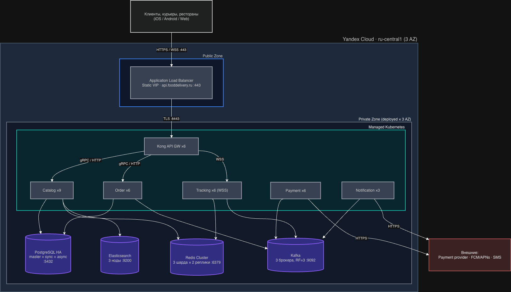

# Deployment Document: Агрегатор доставки еды

> Документ описывает эксплуатацию системы: развёртывание, стратегию деплоя, observability, доступность и TCO.
---

## 1. Архитектура развёртывания

### 1.1. Назначение и нагрузка

**Назначение.** Агрегатор доставки еды по модели Яндекс.Еды для России и СНГ. Пользователи ищут рестораны, оплачивают заказы и отслеживают доставку; рестораны принимают заказы; курьеры обновляют статус и геопозицию.

**Профиль нагрузки** (детально - `requirements.md` раздел 3):

| Параметр | Значение |
|---|---|
| MAU | 12 млн (с горизонтом роста до 20 млн за 3 года) |
| DAU | 3 млн |
| Средний RPS | 300 |
| **Пиковый RPS (обеденный, 11:00-14:00)** | **5 500** |
| Каталог/поиск (read-heavy) | 2 800 RPS пик |
| Трекинг статуса | 2 200 RPS пик |
| Checkout | 550 RPS пик |
| WebSocket-соединений (трекинг) | 25-30 тыс. одновременно |
| Заказов в день | 900 000 |
| Egress (API, без CDN) | ~3 Gbps пик |
| Прирост данных (orders) | ~4.5 GB/день, ~1.6 TB/год |

**Пиковые сценарии:** обеденный пик 11:00-14:00 (Peak_coef = 2). Маркетинговые пики не учтены - см. открытый вопрос 6 в `requirements.md`.

### 1.2. Топология

- **Регион:** один (Yandex Cloud `ru-central1`) - задано ограничениями бюджета (`requirements.md` раздел 4.2.1).
- **AZ:** 3 (`ru-central1-a`, `ru-central1-b`, `ru-central1-c`). Все stateless-сервисы и stateful-хранилища распределяются по AZ для multi-AZ HA.
- **VPC:** одна, три подсети по AZ. Public subnet - только балансировщик; всё остальное - в private subnets.

| Зона | Что внутри | CIDR (пример) |
|---|---|---|
| Public | Application Load Balancer (TLS termination) | `10.0.0.0/24` (NAT GW) |
| Private AZ-a | K8s nodes, PG master/replica, Redis shard, Kafka broker, ES node | `10.0.1.0/24` |
| Private AZ-b | K8s nodes, PG sync replica, Redis shard, Kafka broker, ES node | `10.0.2.0/24` |
| Private AZ-c | K8s nodes, Redis shard, Kafka broker, ES node | `10.0.3.0/24` |

**Static IP:** только LB VIP (`api.fooddelivery.ru` → A-record) и NAT GW. Поды и инстансы за autoscaling - эфемерные IP, на диаграмме не отмечаются.

### 1.3. Deployment Diagram

Диаграмма: [`docs/diagrams/c4-l3-deployment.drawio`](diagrams/c4-l3-deployment.drawio)



Сервисы показаны одним блоком с пометкой суммарного числа реплик (`xN` по всем AZ); AZ-распределение - в разделах 1.2 и 1.4 (дублировать каждый сервис три раза на диаграмме не несёт новой информации сверх таблиц).

**Связи (направление, порт):**

| Источник → Назначение | Протокол / порт | Назначение |
|---|---|---|
| Клиент → ALB | HTTPS :443, WSS :443 | вход в систему |
| ALB → Kong | TLS :8443 | проксирование |
| Kong → Catalog/Order/Tracking | gRPC :50051 / HTTP :8080 | бизнес-вызовы |
| Catalog → PostgreSQL | TCP :5432 | CRUD ресторанов |
| Catalog → Redis | TCP :6379 | кэш меню (TTL 5 мин) |
| Catalog → Elasticsearch | HTTP :9200 | поиск |
| Order → PostgreSQL | TCP :5432 | заказы, saga_state |
| Order → Kafka | TCP :9092 | publish `payment.requests` |
| Payment → Kafka | TCP :9092 | consume requests, publish results |
| Payment → внешний провайдер | HTTPS :443 | процессинг карт |
| Tracking → Redis | TCP :6379 | GEOADD/GEORADIUS курьеров |
| Tracking → Kafka | TCP :9092 | consume `OrderPaid`, `CourierAssigned` |
| Notification → Kafka | TCP :9092 | consume событий |
| Notification → FCM/APNs/SMS | HTTPS :443 | внешние нотификации |

### 1.4. Список сервисов

| # | Сервис | Тип | Зона | Replicas | Ответственность |
|---|--------|-----|------|----------|-----------------|
| 1 | **API Gateway (Kong)** | stateless | private (за ALB) | 2 в каждой AZ = **6** | JWT-auth, rate-limit, маршрутизация, TLS termination от ALB |
| 2 | **Catalog Service** | stateless | private | 3 в каждой AZ = **9** | поиск/меню; кэш в Redis, поиск через ES |
| 3 | **Order Service** | stateless | private | 2 в каждой AZ = **6** | заказы, saga-оркестрация, выпуск событий в Kafka |
| 4 | **Payment Service** | stateless | private (отдельный PCI-сегмент) | 2 в каждой AZ = **6** | процессинг платежей, webhook’и, reconciliation |
| 5 | **Tracking Service** | stateless (sticky WS-сессии на ALB) | private | 2 в каждой AZ = **6** | WebSocket-сервер для клиентов, координаты курьеров |
| 6 | **Notification Service** | stateless | private | 1 в каждой AZ = **3** | push/SMS, consume событий из Kafka, DLQ |
| 7 | **PostgreSQL** | **stateful** | private | master + 1 sync replica + 1 async replica | заказы, платежи, рестораны, saga_state |
| 8 | **Redis** | **stateful** | private | 3 шарда x 2 реплики = **6** | кэш меню, geo курьеров, rate-limit, сессии |
| 9 | **Kafka** | **stateful** | private | 3 брокера (по 1 в AZ) | event bus, RF=3, min.insync=2 |
| 10 | **Elasticsearch** | **stateful** | private | 3 ноды (по 1 в AZ) | full-text + geo поиск ресторанов |

**Public/private.** Public endpoint только один: `api.fooddelivery.ru` (ALB). Всё остальное - в private subnets, доступ только внутри VPC. Payment Service дополнительно сегментирован security group’ами для PCI DSS scope.

---

## 2. Стратегия деплоя

### 2.1. Сводная таблица

| Сервис | Стратегия | Почему именно она |
|--------|-----------|-------------------|
| API Gateway (Kong) | **Rolling** (maxSurge 25%, maxUnavailable 0) | stateless, идемпотентные запросы, нужен zero-downtime - Rolling достаточно. Canary не нужен: gateway не содержит бизнес-логики |
| Catalog Service | **Rolling** | read-heavy, идемпотентный. Откат - обычный rollback deployment’а |
| Order Service | **Rolling + Canary 10% на 1 час** | трогает деньги через Kafka. Canary даёт окно на ловлю регрессий до полного раскатывания |
| Payment Service | **Canary 5% → 25% → 50% → 100%** (gating по error rate) | PCI scope, ошибка = потерянные деньги (НФТ-006: < 1 на 10⁸ транзакций). Полный rolling слишком рискован |
| Tracking Service | **Rolling с увеличенным `terminationGracePeriodSeconds=120`** | долгоживущие WebSocket-соединения. Нужно дать клиентам мигрировать на новые поды |
| Notification Service | **Rolling** | при перезапуске Kafka consumer group делает rebalance - события не теряются, обрабатываются с того же offset’а |

### 2.2. Zero-downtime контракт

Применимо ко всем stateless-сервисам:

**Probes:**

| Probe | Что проверяет | Поведение |
|-------|---------------|-----------|
| **readiness** | `/health/ready` - соединение с PG/Kafka/Redis для конкретного сервиса | под исключается из upstream до момента, пока зависимости не отвечают |
| **liveness** | `/health/live` - процесс жив, event loop отвечает | kubelet перезапускает под при liveness fail |
| **startup** | `/health/ready` с initialDelaySeconds=10, failureThreshold=30 | даёт время на прогрев пула соединений / Kafka rebalance |

**Graceful shutdown** (контракт для каждого сервиса):

1. SIGTERM → readiness начинает отдавать 503.
2. Сервис ждёт `preStopHook` 10 сек, чтобы ALB/ingress удалил под из upstream.
3. Прекращает приём новых HTTP/WebSocket-соединений.
4. Дренирует in-flight запросы до `terminationGracePeriodSeconds` (по умолчанию 30 сек; Tracking - 120 сек).
5. Kafka consumer: commit текущего offset’а, закрытие session.
6. SIGKILL - только если не уложились в grace.

### 2.3. Миграции БД

Подход: **Expand / Contract** (двухфазный, совместимый с rolling deploy).

| Фаза | Что делается | Когда |
|------|--------------|-------|
| **Expand** (миграция 1) | добавить новые колонки/индексы, оставить старые. Деплой v1.5 пишет в обе схемы | до деплоя кода, требующего новой схемы |
| **Deploy** | rolling deploy кода, который использует новую схему | после Expand |
| **Backfill** | заполнить новые колонки данными старых (батчами, без длинных транзакций) | в фоне |
| **Contract** (миграция 2) | удалить старые колонки/индексы | следующий релиз, когда нет роллбэков назад |

**Где это критично:**
- `orders`, `payments` - финансовая критичность, нельзя ронять записи на время миграции.
- `saga_state` - обновляется в одной транзакции с `orders` (см. ADR-003); миграция любой из них требует Expand/Contract.

**Где не применимо:**
- Redis - кэш, можно очистить и прогреть заново. RPO допускает полную потерю.
- Elasticsearch - переиндексируем из PG; пишем алиасы `restaurants_v1` / `restaurants_v2` и переключаем алиас атомарно.
- Kafka - схема событий через Schema Registry с backward-compatible эволюцией Avro.

---

## 3. Observability

### 3.1. Алерты (Golden Signals, ровно 4)

Алерты ставятся на **critical path** = checkout (НФТ-001) и catalog (НФТ-002), так как это самый дорогой бизнес-путь.

| # | Signal | Метрика | Порог + окно | На какой сервис |
|---|--------|---------|--------------|------------------|
| 1 | **Latency** | `http_request_duration_seconds{route="/api/v1/orders/{id}/pay"}` p99 | **> 2000 ms за 5 мин подряд** (нарушение SLO НФТ-001) | Order Service |
| 2 | **Errors** | `rate(http_requests_total{route=~"/api/v1/orders.*",code=~"5.."}[5m]) / rate(http_requests_total{route=~"/api/v1/orders.*"}[5m])` | **> 0.5% за 5 мин** (порог НФТ-005 для платёжного контура - 99.99%, на orders жёстче чем общий 0.1%) | Order Service |
| 3 | **Traffic** | `sum(rate(http_requests_total{route=~"/api/v1/restaurants.*"}[5m]))` | **< 20% от 7-day baseline** за 10 мин (упал поиск = упал каталог или upstream) | Catalog Service |
| 4 | **Saturation** | `pg_stat_activity_count / pg_settings_max_connections` (по primary) | **> 85% за 5 мин** (пул кончается - соревнование за коннекты) | PostgreSQL |

Не выносим в алерты (попадают на дашборды, но дежурного будят только при устойчивом нарушении): WebSocket disconnect rate, Kafka consumer lag, Redis hit ratio.

### 3.2. Дашборды (3 уровня)

**Overview (один экран, для дежурного):**
- 4 Golden Signals по всей системе: суммарный RPS, error-rate, p50/p99 latency, насыщение по самой загруженной БД/брокеру.
- Чёрный/зелёный статус по SLO (НФТ-001-004).
- Текущая нагрузка vs baseline (% от пика).
- Открытые алерты.

**Service-level (RED, по сервисам):**
- На каждый из 6 сервисов: **R**ate (RPS) / **E**rrors (% 5xx) / **D**uration (p50, p95, p99) по основным эндпоинтам.
- Перцентили в разрезе по route и method.
- Версия пода / коммит (для канареечных раскаток).

**Diagnostic (USE + traces, для root-cause):**
- USE по ресурсам: CPU/RAM/disk/network на K8s nodes и managed-кластерах.
- PostgreSQL: long-running queries, lock waits, replication lag, bloat, IOPS.
- Kafka: consumer lag по группам, partition distribution, throughput per broker.
- Redis: hit rate, evictions, slowlog.
- Elasticsearch: query latency, shard balance, JVM heap.
- Поиск по `trace_id` (Tempo/Jaeger) - для разбора конкретного запроса.

### 3.3. Логи

**Формат:** JSON в stdout (агрегируется в Cloud Logging). Обоснование: единый формат для парсинга, встроенная корреляция полей в YC.

**Обязательные поля:**

```json
{
  "ts": "2026-05-11T10:23:45.123Z",
  "level": "info|warn|error",
  "service": "order-service",
  "version": "1.4.2",
  "trace_id": "01HQK8...",
  "span_id": "a3b1...",
  "msg": "order created",
  "http.method": "POST",
  "http.path": "/api/v1/orders",
  "http.status": 201,
  "duration_ms": 87,
  "user_id_hash": "sha256:..."
}
```

**Что логируем:**
- Входящий HTTP/gRPC запрос (метод, путь, статус, длительность).
- Исходящий вызов в PG/Redis/Kafka/внешний API (адресат, длительность, исход).
- Ошибки со stack trace.
- Бизнес-события: смена статуса заказа, payment outcome, отказ от заказа.

**Что НЕ логируем:**
- PII в открытом виде: phone, email, address, ФИО → хэшируем (`user_id_hash`) или маскируем.
- Секреты: JWT, `card_token`, `Idempotency-Key`, провайдерские webhook signatures.
- Полные тела запросов/ответов с card_data (PCI DSS).
- Координаты курьеров на info-уровне (только debug, и только в diagnostic).

---

## 4. Доступность

### 4.1. Целевая доступность

Используем составную целевую SLA по контурам (НФТ-005), а не одну цифру на всю систему - у компонентов разный бизнес-вес.

| Контур | Целевая availability | Простой/год | Обоснование |
|--------|---------------------|-------------|--------------|
| **Платёжный контур** (Payment + Kafka + PG payments) | **99.99 %** | 53 мин | См. расчёт ниже |
| **Заказы** (Order + PG orders) | **99.95 %** | 4.4 часа | Простой = клиент не оформит заказ. Дороже всего, но 99.99 = удвоение цены |
| **Каталог и поиск** (Catalog + ES + Redis-cache) | **99.9 %** | 8.8 часа | Можно деградировать на cache/PG-fallback при падении ES |
| **Уведомления** (Notification + FCM/SMS) | **99.5 %** | 1.8 дня | Push можно дослать с задержкой - события в Kafka не теряются |

**Расчёт цены простоя (обоснование 99.99% для платежей):**

- 900 000 заказов/день (НФТ, раздел 3.2).
- Средний чек около 1 200 руб (оценка по `avg_price` ресторанов + типичная корзина на 2-3 позиции).
- GMV/день около 900 000 x 1 200 = **1.08 млрд руб**.
- Комиссия платформы ~25 % → **выручка около 270 млн руб/день, в среднем 11.3 млн руб/час**.
- В обеденный пик (Peak_coef=2) - **~22 млн руб/час** упущенной выручки при недоступной оплате.
- 99.95 % = 4.4 часа простоя в год → **до ~100 млн руб/год** при «удачном» (пиковом) попадании; 99.99 % = 53 мин → **до ~20 млн руб/год**.
- Дельта между 99.99 и 99.95 → **порядка 80 млн руб/год**, что многократно перекрывает стоимость sync-replica PG, отдельного канареечного деплоя Payment и резерва провайдера.

Поэтому для платежей закладываем 99.99 %; для остальных контуров - более экономичные числа.

### 4.2. RPO / RTO по компонентам

| Компонент | RPO | RTO | Как достигается |
|-----------|-----|-----|------------------|
| **PostgreSQL** (orders, payments) | **0** | **2-3 мин** | Managed PG: sync-репликация на standby в соседней AZ + async-реплика в третьей. Auto-failover. WAL архивируется в Object Storage (PITR на 7 дней) |
| **Redis** (кэш меню, сессии) | допустима полная потеря | < 1 мин (прогрев) | Cache aside, источник правды - PG/ES. На время прогрева - деградация p99, но не отказ |
| **Redis** (geo, курьеры) | ~5 сек | < 1 мин | Курьер шлёт координаты каждые 5 сек - данные восстановятся естественно |
| **Kafka** | **0** | автоматический failover ~30 сек | `replication.factor=3`, `min.insync.replicas=2`, `acks=all` для producers критичных топиков (`payment.requests`, `payment.results`) |
| **Elasticsearch** | до 1 часа | 10-30 мин (managed failover или переиндексация из PG) | PG - источник правды для ресторанов. ES - индекс, который можно построить заново |
| **Object Storage** (архив старых партиций, бэкапы WAL) | 0 | n/a | YC Object Storage: репликация между AZ из коробки, SLA на доступность 99.98 % |

### 4.3. Стратегия резервирования

Ограничение из `requirements.md` (раздел 4.2.1): один регион, multi-region не закладываем (бюджет). Поэтому везде - **multi-AZ в пределах одного региона**.

| Компонент | Схема | Геораспределение |
|-----------|-------|-------------------|
| Stateless сервисы (1-6) | **active/active** во всех 3 AZ | в пределах региона |
| PostgreSQL | **active/standby** (master + sync replica в др. AZ + async в 3-й AZ) | regions: нет |
| Redis | **active/active sharded** (Redis Cluster, 3 шарда, реплики в др. AZ) | regions: нет |
| Kafka | **active/active** (3 брокера по AZ, RF=3) | regions: нет |
| Elasticsearch | **active/active** (3 ноды, primary+replica шарды по AZ) | regions: нет |
| Внешний платёжный провайдер | **active/standby** (основной + резервный) - на этап MVP оставляем основной, обвязка для подключения второго - задача после релиза | n/a |

**Что не закрыто текущей стратегией (риски):**
- Авария на уровне региона YC `ru-central1` положит всё. Компенсирующий контроль - еженедельные межрегиональные бэкапы PG в Object Storage другого региона; восстановление в случае катастрофы ручное, RTO 4-8 часов. См. открытый вопрос 1 в `requirements.md`.

### 4.4. Maintenance window

- **Когда:** вт/чт **03:00-05:00 MSK** - провал ночного трафика (минимум активных клиентов и заказов, пик закончился, утренний ещё не начался).
- **Как часто:** до 2 раз в неделю, не каждую неделю - по необходимости (миграции, мажорные апгрейды managed-сервисов).
- **Что делаем:**
  - Мажорные апгрейды managed-сервисов YC (PG minor versions, Kafka, ES).
  - Contract-фаза миграций БД (drop колонок/индексов).
  - Учения по failover (раз в квартал - отключение AZ на 30 мин).
- **Что НЕ делаем в maintenance window:** изменения в Payment Service (Canary в рабочее время - даёт быстрый rollback) и любые операции без зелёного rollback-плана.

---

## 5. TCO в Yandex Cloud

> **Важно:** цены приведены как **ориентир порядка величины** (задание явно говорит «точность до рубля не нужна - важен порядок величины»).

### 5.1. Маппинг компонентов на сервисы YC

| Наш компонент | Сервис YC | Sizing на 1x нагрузку (5 500 RPS) |
|---|---|---|
| K8s (под stateless-сервисы 1-6) | **Managed Service for Kubernetes** | master HA + 6 worker nodes Intel Cascade Lake 4 vCPU / 16 GB |
| ALB + Kong | **Application Load Balancer** + те же K8s nodes для Kong | 1 ALB, 6 подов Kong на K8s |
| PostgreSQL | **Managed Service for PostgreSQL** | HA: 2 host’а (master + sync replica), 8 vCPU / 32 GB, 500 GB SSD каждый |
| Redis | **Managed Service for Valkey** | 3 шарда x 2 реплики, 4 GB на инстанс |
| Kafka | **Managed Service for Apache Kafka** | 3 брокера, 4 vCPU / 16 GB, 500 GB SSD каждый |
| Elasticsearch | **Managed Service for OpenSearch** (либо self-hosted на Compute) | 3 ноды, 4 vCPU / 16 GB, 200 GB SSD каждая |
| Архив старых партиций orders, бэкапы WAL | **Object Storage** | ~5 TB cold tier на горизонте 3 лет |
| Мониторинг + логи | **Yandex Monitoring + Cloud Logging** | ~200 GB логов/мес после фильтрации |
| Egress трафик (API) | YC Network | ~30-40 TB/мес исходящего |

### 5.2. Стоимость на текущую нагрузку (1x = 5 500 RPS пик)

| Категория | Конфигурация | Оценка руб/мес |
|-----------|---------------|--------------:|
| **Compute (K8s workers)** | 6 x 4 vCPU/16 GB (100% guaranteed) | ~60 000 |
| Managed K8s master (HA) | regional | ~3 000 |
| **PostgreSQL HA** | 2 x 8 vCPU/32 GB + 2 x 500 GB SSD | ~60 000 |
| **Redis Cluster** | 6 инстансов x 4 GB | ~20 000 |
| **Kafka** | 3 x 4 vCPU/16 GB + 3 x 500 GB SSD | ~65 000 |
| **Elasticsearch / OpenSearch** | 3 x 4 vCPU/16 GB + 3 x 200 GB SSD | ~70 000 |
| **Application LB** | 1 ALB, средняя нагрузка ~6 RU (bandwidth-bound при пике 3 Gbps) | ~12 000 |
| **Object Storage** | ~1 TB на старте (cold) | ~2 000 |
| **Egress трафик** | ~30 TB/мес (среднее x overhead) | ~40 000 |
| **Monitoring + Logging** | ~1 млрд values/мес метрик + 200 GB логов (тариф Monium) | ~5 000 |
| **NAT GW, VPC, прочее** | базовые network-компоненты | ~5 000 |
| **Итого инфраструктура** | | **около 342 000 руб/мес** |

### 5.3. Рост до 2x (около 11 000 RPS пик)

Stateless-сервисы - линейно по числу подов. PG - пока вертикально (scale-up master), Kafka - больше партиций без увеличения числа брокеров, ES - +2 ноды.

| Категория | Что меняется | Оценка руб/мес |
|-----------|--------------|--------------:|
| Compute (K8s workers) | 12 nodes (x2) | ~120 000 |
| Managed K8s master | - | ~3 000 |
| PostgreSQL HA | scale-up до 16 vCPU/64 GB + 1 TB SSD, +1 read replica | ~120 000 |
| Redis Cluster | +1 шард → 4 шарда x 2 реплики | ~27 000 |
| Kafka | те же 3 брокера, но 8 vCPU/32 GB + 1 TB SSD | ~98 000 |
| Elasticsearch | 5 нод x 4 vCPU/16 GB + 5 x 300 GB SSD | ~125 000 |
| ALB | средняя ~10 RU (x 1 920 руб) | ~20 000 |
| Object Storage | ~2 TB | ~4 000 |
| Egress | ~60 TB/мес | ~73 000 |
| Monitoring + Logging | ~2 млрд values + 400 GB логов | ~8 000 |
| NAT / прочее | - | ~7 000 |
| **Итого 2x** | | **около 605 000 руб/мес** |

### 5.4. Рост до 5x (около 27 500 RPS пик - близко к 3x из НФТ-007)

На 5x уже **не хватает вертикального масштабирования PG** - нужно либо горизонтальное шардирование (orders по `restaurant_id` или `user_id`), либо переход на распределённое решение (например, YDB). Здесь закладываем шардирование PG на 4 шарда + переход Kafka на 6 брокеров.

| Категория | Что меняется | Оценка руб/мес |
|-----------|--------------|--------------:|
| Compute (K8s workers) | 30 nodes (x5 со скидкой за плотность) | ~280 000 |
| Managed K8s master (HA) | - | ~5 000 |
| PostgreSQL - 4 шарда HA | 4 x (master 16 vCPU/64 GB + sync replica) + 1 TB SSD на каждом | ~400 000 |
| Redis Cluster | 8 шардов x 2 реплики, 8 GB | ~80 000 |
| Kafka | 6 брокеров x 8 vCPU/32 GB + 1 TB SSD | ~195 000 |
| Elasticsearch | 9 нод x 4 vCPU/16 GB + 500 GB SSD | ~250 000 |
| ALB | средняя ~22 RU (x 1 920 руб), запас на пики маркетинга | ~45 000 |
| Object Storage | ~10 TB | ~20 000 |
| Egress | ~150 TB/мес | ~187 000 |
| Monitoring + Logging | ~5 млрд values + 1 TB логов (порог 10 000 ед. ещё не достигнут) | ~19 000 |
| NAT / прочее | - | ~15 000 |
| **Итого 5x** | | **около 1 496 000 руб/мес** |

### 5.5. Операционные затраты

| Статья | Оценка руб/мес |
|---|--------------:|
| **On-call rotation** (1 дежурный 24/7, ротация 4-5 инженеров с надбавкой за дежурства) | ~300 000 |
| **DevOps / Platform** (поддержка инфры, CI/CD, обновления) - ~0.5 FTE | ~200 000 |
| **Observability tooling / лицензии** (если выйдем за бесплатные тиры Grafana Cloud / Sentry) | ~30 000 |
| **Обучение и аудиты** (подготовка к PCI DSS, ФЗ-152) - амортизация | ~50 000 |
| **Резерв на инциденты** (post-mortems, hotfix-окна) | ~30 000 |
| **Итого ops** | **около 610 000 руб/мес** |

> Ops-затраты слабее зависят от трафика - рост 2x/5x добавляет +1 инженера на on-call в 5x сценарии (~+200k). В 2x - ops стабилен.

### 5.6. Сводная таблица + комментарий

| | 1x (5 500 RPS) | 2x (11 000 RPS) | 5x (27 500 RPS) |
|---|---:|---:|---:|
| Инфраструктура | **342 000** | **605 000** | **1 496 000** |
| Операционные | 610 000 | 610 000 | 810 000 |
| **Всего руб/мес** | **около 0.95 млн** | **около 1.22 млн** | **около 2.31 млн** |
| Удельная стоимость, руб/1000 заказов | ~35 | ~23 | ~17 |

**Что дороже всего и почему:**

1. **На 1x:** тройка лидеров идёт плотно - Elasticsearch (~21 % инфры), Kafka ( ~19 %), PostgreSQL и Compute (по ~18 % каждый). ES держим в 3 нодах с 16 ГБ RAM и SSD на каждой ради query latency на 2 800 RPS каталога. Kafka - 3 брокера с RF=3 и 1.5 ТБ SSD под retention 7 дней даже на малом RPS (нельзя экономить на durability платёжного потока). PG дороже всего своей HA-парой, которая дублирует и compute, и storage.

2. **На 2x:** картина сглаживается - Compute, PG и ES идут почти вровень (по ~20 % каждый), Kafka чуть отстаёт (~16 %). Stateless и stateful масштабируются почти одинаково: stateless - числом подов, stateful - через scale-up master PG и +2 ноды ES.

3. **На 5x:** доминирует PG (~27 % инфры) из-за шардирования на 4 части с полной HA-парой на каждый шард - это уже сигнал, что при пиковых сценариях типа 18 000+ RPS из НФТ-007 имеет смысл рассмотреть YDB или сегрегацию orders/payments в разные кластеры.

4. **Исходящий трафик** становится заметной долей (~12 %) и линейно растёт. Если станут критичны деньги - имеет смысл вынести медиа (фото блюд) на CDN (это и так запланировано в `requirements.md`, раздел 3.5), что снимет до 70 % исходящего.

5. **Операционные затраты остаются почти константой** до 5x, но в относительной доле снижаются - это и есть экономия масштаба: одна команда поддерживает кратно больший трафик.